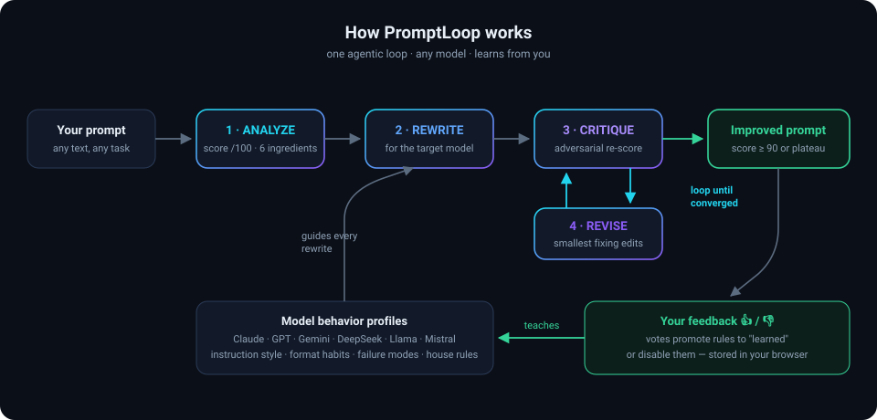

# PromptLoop 🔁

**An agentic loop that rewrites any prompt for any AI model — and learns from your feedback.**

One HTML file. No install, no server, no build. Download it, double-click it, paste a prompt, and watch four AI stages — **Analyze → Rewrite → Critique → Revise** — iterate until your prompt scores 90+/100 for the exact model you plan to use it with.

  

## What it does

- **Scores your prompt like an engineer, not a vibe.** Six ingredients — role, objective, context, constraints, output format, reasoning trigger — each rated 0–5 with evidence, plus six anti-pattern checks. The total is computed deterministically in code, so the AI can't grade its own homework.
- **Starts from your definition of done.** Before the loop runs, you say what a good output must achieve ("runs without edits", "under 120 words", "only real bugs with file:line refs"). Every stage judges against *your* bar, not a generic one.
- **Rewrites for the model you'll actually use.** A prompt tuned for Claude is not optimal for Llama. PromptLoop applies a per-model behavior profile (instruction style, format habits, known failure modes, house rules) and every single change is annotated with *why* it was made.
- **Closes the loop on the real output.** One click runs the improved prompt on the target model. You judge the actual output: *Done* or *Not done — here's what's wrong*. A "not done" verdict refines the prompt from the real failure, and you test again. Prompt → output → verdict → better prompt.
- **Improves itself every time you use it.** Verdicts and 👍/👎 votes promote profile rules to "learned" or disable them entirely — so the next run genuinely behaves differently. Your regular prompts live in **My prompts** and keep getting better across sessions. All of it stays in your browser.

## How it works

The loop stops honestly: when the score hits 90+, when a round stops adding value (plateau), or at the round cap — and it tells you which one happened. A "coach" model runs the loop (default: DeepSeek, costs about a cent per run); the "target" model is who your prompt is *for*. They're deliberately independent — that's the whole point.

## Get started in 60 seconds

1. **Download the app** — either way works:
   - Right-click **[this raw link](https://raw.githubusercontent.com/umairshoaiby/promptloop/main/PromptLoop.html)** → *Save link as* → `PromptLoop.html`, **or**
   - Click the green **Code** button above → **Download ZIP** → extract it anywhere → open the folder.
2. **Double-click `PromptLoop.html`.** It opens in your browser like any web page — nothing installs. Click **▶ Watch a sample run** to see the loop with zero setup.
3. **For real runs:** grab a free key at [openrouter.ai/keys](https://openrouter.ai/keys), click **API key** in the top-right, paste it. One key unlocks every model.

Then paste any prompt you actually use, write your definition of done, pick your target model from the dropdown, and hit **Run the loop**.

## Make it part of your day

PromptLoop is built for the prompts you use *repeatedly* — the code request, the status email, the review ask you type every week. The workflow:

1. **Keep `PromptLoop.html` on your desktop** (or bookmark it). It opens instantly, works offline except for the model calls.
2. **Bring a regular prompt** and write its definition of done — what must be true of the output for you to call it finished.
3. **Run the loop** — get the improved, model-targeted version.
4. **Close the loop:** click **▶ Run it on [your model]** and judge the real output. *Done* proves the prompt. *Not done* + one sentence about what's wrong refines it from the actual failure — then test again.
5. **Save it to My prompts.** Next week, load it, run it, judge it. The saved version and the model's profile both keep improving from every verdict.

After a few cycles you have a personal library of proven prompts, each tuned to the model you use and refined against real outputs — not guesses.

## How the learning works (honestly)

The six model profiles ship as **seed heuristics** — starting hypotheses written from public provider documentation and community experience, *not* benchmarked claims. Every field is labeled with its confidence and provenance, and the app exists to correct them:

- 👍 / 👎 on any change votes on the rule that motivated it.
- Net **+3** promotes a rule to medium confidence, **+6** to high ("learned").
- Net **−3** disables a rule — the rewriter stops applying it for that model.
- The **Model profiles** panel shows exactly what's seed vs. learned, with vote counts.

Everything — your API key, your votes, your learned profiles — lives in `localStorage` in your browser. Nothing is sent anywhere except your prompt to OpenRouter when you run the loop. Found profile rules that work? **Export the JSON** from the profiles panel and open a PR — the [`profiles/`](profiles/) folder is the shared, community-refined version.

## Supported models

| Family | Models with seeded profiles |
|---|---|
| Anthropic | Claude Fable 5 · Claude Opus 4.8 · Claude Sonnet 5 · Claude Haiku 4.5 |
| OpenAI | GPT-5.5 |
| Google | Gemini 3.5 Flash |
| DeepSeek | V4 Pro · V4 Flash (default coach) |
| Moonshot AI | Kimi K3 |
| Alibaba | Qwen 3.7 Max |
| Meta | Llama 4 Maverick · Llama 4 Scout |
| Mistral | Mistral Large |
| xAI | Grok 4.5 |

14 seeded profiles, and any other OpenRouter model id works too — type it in the custom field (it just won't have a seeded profile until you teach it one). Profile JSONs live in [`profiles/`](profiles/).

## FAQ

**Is my API key safe?** It's stored only in your browser's localStorage and sent only to OpenRouter over HTTPS. This is a single static HTML file — there is no server, no analytics, no tracking. The code is right there; read it.

**Does it cost money?** A full loop makes 5–10 small model calls. With the default coach that's roughly **$0.01 per run**. New OpenRouter accounts also get free credits to start with.

**Why one HTML file instead of an app?** Zero friction and full auditability. Anyone can download it, open it, and read every line of what runs on their machine — which matters for a file you give an API key to.

**Can I add my own model?** Type any OpenRouter id in the custom field, or copy a JSON file in [`profiles/`](profiles/) as a template and PR it.

## Roadmap

- Community profile merging (import a shared profile pack)
- Side-by-side compare — original vs. improved output in one view
- Packaged desktop build for offline-first teams
- More seeded models as their behavior stabilizes

---

Built by [Umair Shoaiby](https://github.com/umairshoaiby) · MIT License
